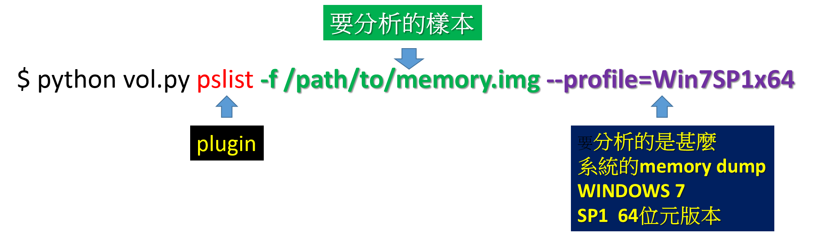

# The Volatility Framework

>* 
>* https://github.com/volatilityfoundation/volatility
 
>* 
>* 
```
```
## Using Volatility

https://github.com/volatilityfoundation/volatility/wiki/Volatility-Usage

$ python vol.py [plugin] -f [image] --profile=[profile] 

$ python volatility.py [plugin] -f [image] --profile=[profile] 



常用指令

看看支援那些 profiles ==> $ python vol.py –info

## The Volatility Framework:Volatility Plugins

>* http://www.forensicswiki.org/wiki/List_of_Volatility_Plugins

```
apihooks                   - Detect API hooks in process and kernel memory
crashinfo                  - Dump crash-dump information
dlldump                    - Dump DLLs from a process address space
dlllist                    - Print list of loaded dlls for each process
dumpfiles                  - Extract memory mapped and cached files
dumpregistry               - Dumps registry files out to disk
handles                    - Print list of open handles for each process
hashdump                   - Dumps passwords hashes (LM/NTLM) from memory
hibinfo                    - Dump hibernation file information
hivedump                   - Prints out a hive
hivelist                   - Print list of registry hives.
```

linux 相關plugins
```
linux_apihooks             - Checks for userland apihooks
linux_arp                  - Print the ARP table
linux_aslr_shift           - Automatically detect the Linux ASLR shift
linux_banner               - Prints the Linux banner information
linux_check_inline_kernel  - Check for inline kernel hooks
linux_check_modules        - Compares module list to sysfs info, if available
linux_check_syscall        - Checks if the system call table has been altered
linux_check_syscall_arm    - Checks if the system call table has been altered
linux_elfs                 - Find ELF binaries in process mappings
linux_lsof                 - Lists file descriptors and their path
linux_malfind              - Looks for suspicious process mappings
linux_memmap               - Dumps the memory map for linux tasks
linux_moddump              - Extract loaded kernel modules
```
## 實務演練環境:

#### 實務演練環境1:使用kali linux內附的

#### 實務演練環境2:使用Docker rekall image
```
1.下載:: docker pull remnux/volatility
2. 執行
sudo docker run --rm -it -v ~/memdumps:/home/nonroot/memdumps remnux/volatility bash
then run vol.py in the container with the desired parameters.

Before running the command above, create the "memdumps" directory on your host and make it world-accessible (e.g., chmod a+xwr ~/memdumps).
```
## 實務演練(1):SECCON CTF Quals 2016 : memory-analysis-100[網站已關閉]

>* https://github.com/ctfs/write-ups-2016/tree/master/seccon-ctf-quals-2016/forensic/memory-analysis-100

```
步驟一:volatility -f forensic_100.raw imageinfo

步驟二:顯示Processes運作狀態 ==> volatility -f forensic_100.raw --profile=WinXPSP2x86 pslist

WinXPSP2x86、WinXPSP3x86 結果都一樣

步驟三:一陣努力後者到關鍵的執行程式==>顯示IE瀏覽紀錄==>volatility -f forensic_100.raw --profile=WinXPSP2x86 iehistory


步驟四:

curl http://crattack.tistory.com/entry/Data-Science-import-pandas-as-pd

步驟五:
volatility -f forensic_100.raw --profile=WinXPSP2x86 connscan

當時的crattack.tistory.com是導向153.127.200.178

步驟六:
curl http://153.127.200.178/entry/Data-Science-import-pandas-as-pd

比賽已結束==>網站更新過==>沒有flag

```
[解答1](https://ctf.rip/seccon-2016-quals-memory-analysis-forensics-challenge/)

```
步驟一:
volatility -f forensic_100.raw imageinfo

步驟二:
volatility -f forensic_100.raw pslist | grep svchost

步驟三:
volatility -f forensic_100.raw -p 1704 -D dump procdump

步驟四:
volatility -f forensic_100.raw --profile=WinXPSP3x86 sockets

volatility -f forensic_100.raw --profile=WinXPSP3x86 pslist | grep tcp

volatility -f forensic_100.raw --profile=WinXPSP3x86 -p 3308 -D dump memdump

步驟五:

host crattack.tistory.com

echo 153.127.200.178 crattack.tistory.com >> /etc/hosts

curl http://crattack.tistory.com/entry/Data-Science-import-pandas-as-pd

SECCON{_h3110_w3_h4ve_fun_w4rg4m3_}


```

[解答2](https://blog.nhiroki.net/2016/12/11/seccon-2016-online-ctf-writeup)
```
步驟一:
$ volatility_2.5_linux_x86 -f ./forensic_100.dat --profile=WinXPSP2x86 connections

Foundation Volatility Framework 2.5
Offset(V)  Local Address             Remote Address            Pid
---------- ------------------------- ------------------------- ---
0x8213bbe8 192.168.88.131:1034       153.127.200.178:80        1080


步驟二:
$ strings forensic_100.dat | grep 153.127.200.178

153.127.200.178    crattack.tistory.com attack.tistory.com 
153.127.200.178    crattack.tistory.com 
153.127.200.178:80

步驟三:
$ strings forensic_100.dat | grep 'GET /' 

GET /image/237C0C3E576BA0AD06F720 HTTP/1.1
GET /entry/Data-Science-import-pandas-as-pd HTTP/1.1
GET /entry/Data-Science-import-pandas-as-pd HTTP/1.1
GET /entry/Data-Science-import-pandas-as-pd HTTP/1.1
GET /entry/Data-Science-import-pandas-as-pd HTTP/1.1

步驟四:
$ curl http://attack.tistory.com/entry/Data-Science-import-pandas-as-pd

SECCON{_h3110_w3_h4ve_fun_w4rg4m3_}
```


## 實務演練(2):nuit-du-hack-ctf-quals-2015-bpythonastic-300

>* https://github.com/ctfs/write-ups-2015/tree/master/nuit-du-hack-ctf-quals-2015/forensic/bpythonastic
>* https://wiki.zenk-security.com/doku.php?id=ndhquals2015:bpythonastic

步驟一:確定作業系統版本 ==> strings chall.raw | grep "Linux version"

步驟二:確認相關作業系統版本所需profile

https://packages.ubuntu.com/trusty/all/volatility-profiles/filelist

步驟三:執行基本分析

volatility --plugins=profiles -f chall.raw --profile=Linux_Debian_Squeeze_2_6_32-5-amd64_x64 -h | grep linux_

步驟四:

volatility --plugins=profiles -f chall.raw --profile=Linux_Debian_Squeeze_2_6_32-5-amd64_x64 linux_bash

步驟五:

volatility --plugins=profiles -f chall.raw --profile=Linux_Debian_Squeeze_2_6_32-5-amd64_x64 linux_pstree

volatility --plugins=profiles -f chall.raw --profile=Linux_Debian_Squeeze_2_6_32-5-amd64_x64 linux_proc_maps -p 2364


volatility --plugins=profiles -f chall.raw --profile=Linux_Debian_Squeeze_2_6_32-5-amd64_x64 linux_dump_map -p 2364 --dump-dir=dump

cd dump/
ls -l

strings task.2364.0x1a36000.vma

echo -n "KGljaGFsbApDaGFsbGVuZ2UKcDAKKGRwMQpTJ2ZsYWcnCnAyClMnYTYzOWEyMWE0YTc0NzAzZmEwNDJkNjE3NjgxYWE0NGJiNGQxYzA4YmM1ZmJmN2VmZDZiNDU1ODJiMGYwZDQwMycKcDMKc1MnaWQnCnA0CkkwCnNTJ2F1dGhvcicKcDUKUydZZ2dkcmFzaWwnCnA2CnNiLg==" | base64 -d

http://md5decrypt.net/en/Sha256/


