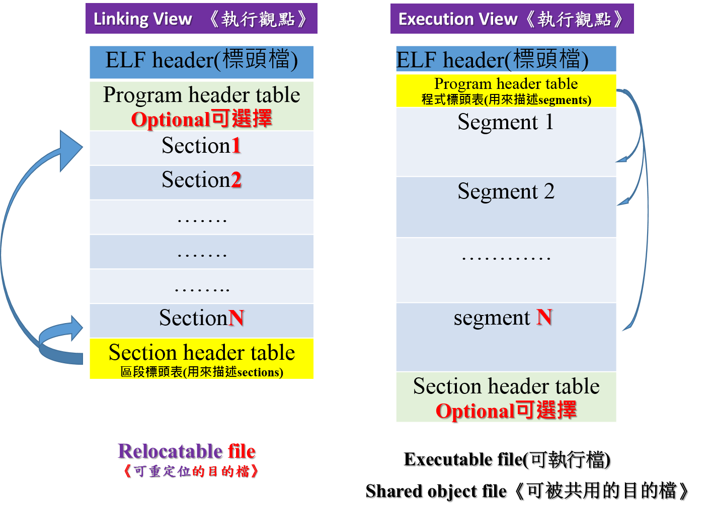

# ELF(Executable and Linking Format)

>* ELF是 object file 的檔案格式，其主要結構是以 section（節區）為主
>* Object file 主要有 3 種類別：

1. relocatable file(副檔名為 .o )

2. executable file(a.out 檔案等一般產生的執行檔)

3. shared object file(副檔名為 *.so（shared libraries）共享函式庫)

# ELF 組成與內部結構internal structure of object and executable files

>* http://www.skyfree.org/linux/references/ELF_Format.pdf

-Each ELF file is made up of one ELF header, followed by file data. 

-The file data can include

1.Program header table, describing zero or more segments.

2.Section header table, describing zero or more sections.

-The segments contain information that is necessary for runtime execution of the file.

-The sections contain important data for linking and relocation.

## Linking View 《執行觀點》 vs Execution View《執行觀點》 

# ELF分析工具:objdump vs Readelf

查看可執行文件的入口處 ==> readelf -h XXXXXXX | grep Entry

# ELF header：檔頭格式32-Bit Data Types

https://github.com/torvalds/linux/blob/master/include/uapi/linux/elf.h
