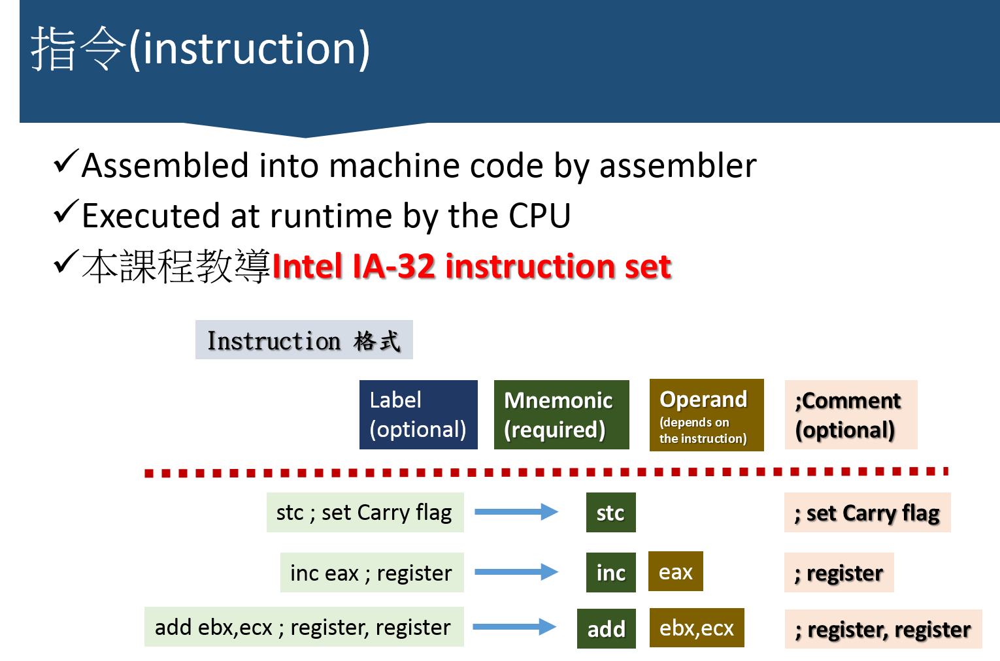

http://www.duntemann.com/assembly.html

### 指令(instruction)

### Intel x86 組合語言與組譯器(https://en.wikipedia.org/wiki/Comparison_of_assemblers)

>* MASM(Microsoft Macro Assembler)
>* [NASM(Netwide Assembler)](https://en.wikipedia.org/wiki/Netwide_Assembler)
>* Flat Assembler (FASM) 
>* GNU Assembler (GAS) 
>* High Level Assembly (HLA) 
>* Turbo Assembler (TASM) 
>* Open Watcom Assembler (WASM) 
>* [Yasm](https://en.wikipedia.org/wiki/Yasm)

### Id常用指令

### NASM組合語言程式範例

目的:小寫轉成大寫
程式名稱:uppercaser2.asm
參考資料:
測試步驟:

nasm -f elf -g -F stabs uppercaser2.asm;    

ld -o uppercaser2 uppercaser2.o

echo asdmvd > test.txt

./uppercaser2 >test_upper.txt < test.txt

cat test_upper.txt 

程式名稱:hexdump.asm
參考資料:CH9

測試步驟:

gedit hexdump1.asm

nasm -f elf -g -F stabs hexdump1.asm

ld -o hexdump1 hexdump1.o

./hexdump1 < /bin/ls

 
